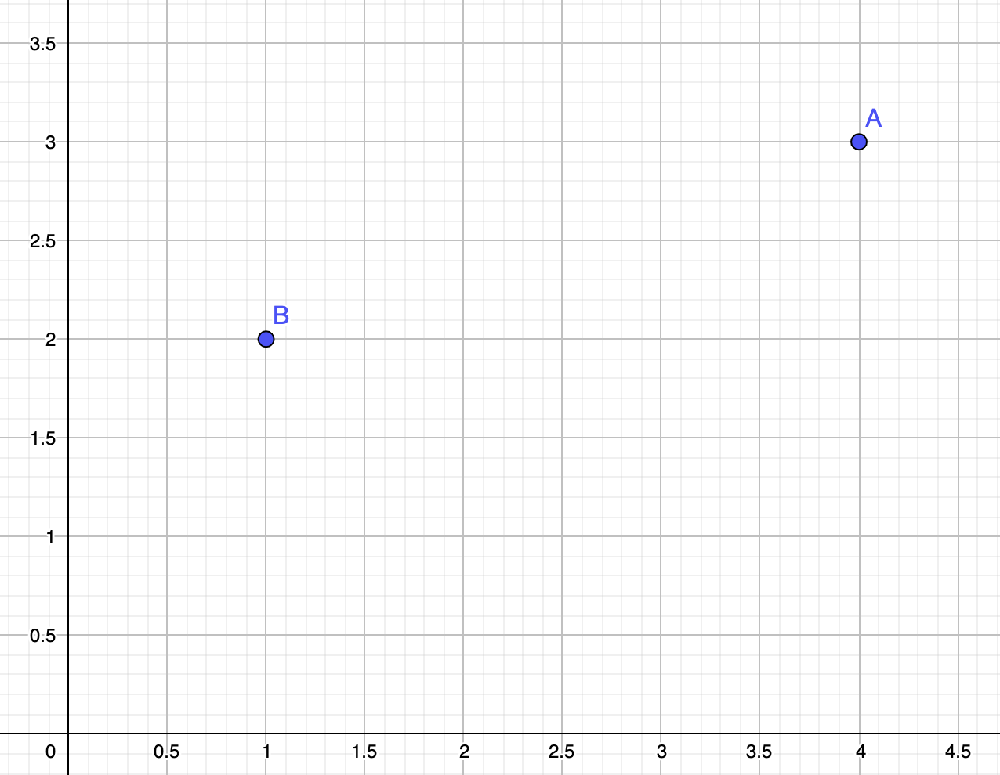

# Repaso

Repasaremos los conceptos fundamentales de la POO desarrollando un
conjunto de objetos que nos permitan representar elementos de geometría
analítica en dos dimensiones.
El concepto fundamental será el de Punto, el cual describe una posición en
el plano determinada por sus coordenadas cartesianas.

# Definición de clases

Comenzamos definiendo la clase y su método constructor:

```python
!include code/unidad0/repaso/Point.py
```

# Instanciando objetos

Podemos crear objetos pertenecientes a la clase del siguiente modo:

```python
!include code/unidad0/repaso/Point.py

!include code/unidad0/repaso/instances.py
```

Cuando llamamos a `Point`, Python se encarga de llamar al método constructor
por nosotros, pasándole los argumentos que corresponden y nos devuelve un
nuevo objeto.
Decimos que `__init__` es un *método mágico* porque no lo invocamos
explícitamente, si no que Python lo hace por nosotros cuando creamos un nuevo
objeto.

# Programacion orientada a objetos

{width=50%}

# Atributos

Las coordenadas `x` e `y` son *atributos* de los objetos de tipo Point.
Podemos obtener el valor del atributo en un objeto utilizando la notación
punto.

```python
!include code/unidad0/repaso/Point.py

!include code/unidad0/repaso/instances.py
!include code/unidad0/repaso/prints.py
```

De la misma forma podemos modificar los atributos de un objeto.

# Imprimiendo Objetos

Para poder imprimir de forma amigable objetos, debemos definir el método mágico
`__str__`.

```python
!include code/unidad0/repaso/Point2.py

!include code/unidad0/repaso/instances.py
!include code/unidad0/repaso/prints2.py
```

 De nuevo `__str__` es un método mágico porque no lo llamamos explícitamente.
 Python lo hace por nosotros cuando le pedimos mostrar el objeto.

 # Igualdad de objetos

 Dos objetos distintos pueden representar el mismo valor, (así como las
 expresiones 5, 25/5 y 5.0 son todas representaciones del "valor" 5).
 Para que Python pueda decidir si dos objetos representan el mismo valor,
 implementamos el método mágico `__eq__`.

```python
!include code/unidad0/repaso/Point3.py

!include code/unidad0/repaso/instances.py
!include code/unidad0/repaso/prints3.py
```

# Métodos mágicos

Los métodos mágicos son aquellos métodos de un objeto que son llamados por
Python sin que nosotros lo hagamos explícitamente.

Los métodos `__init__`, `__str__` y `__eq__` son sólo algunos ejemplos, en la
documentación de Python tenemos una referencia completa de los métodos mágicos,
como se definen y la manera apropiada de hacerlo. [^1]

[^1]: https://docs.python.org/3/reference/datamodel.html\#special-method-names

Otro ejemplo de método mágico es `__sub__` el cual nos permitirá implementar la
*diferencia* entre dos puntos, entendida como la distancia euclideana entre
ellos.

# Métodos mágicos

```python
!include code/unidad0/repaso/Point4.py

!include code/unidad0/repaso/instances.py
!include code/unidad0/repaso/prints4.py
```

# Composicion de clases

 Ya estamos en condiciones de empezar a representar objetos más complejos,
 por ejemplo, polígonos. Un polígono queda definido a partir de sus vértices.
 Es decir, la características o atributos que describen un rectángulo son
 objetos de tipo Point. A esta práctica, de emplear clases dentro de la
 definición de otra, la llamamos **composición de clases**.

# Composicion de clases

```python
!include code/unidad0/repaso/Polygon.py

!include code/unidad0/repaso/instances2.py
```

# Composición de clases

{width=50%}

# Herencia

Supongamos que nuestra aplicación de geometría analítica ahora necesita
permitir el cálculo del área de un rectángulo.

Debemos definir una clase Rectángulo que represente a estos objetos, pero como
los rectángulos son casos particulares de los polígonos, podemos aprovechar el
código que ya tenemos escrito y solo agregar o cambiar la funcionalidad que sea
necesaria.

A esto lo llamamos **herencia de clases**.

# Herencia

```python
!include code/unidad0/repaso/Rectangle.py

!include code/unidad0/repaso/instances3.py
!include code/unidad0/repaso/prints5.py
```

# Preguntas

-----------------------------
 ¿PREGUNTAS?
-----------------------------

# Referencias

- Apunte de Cátedra.  Elaborados por el staff docente. Será subido al campus
virtual de la materia.

- A. Downey et al, 2002. How to Think Like a Computer Scientist. Learning with
Python. Capitulos 12 a 16.
