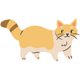
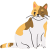
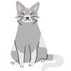
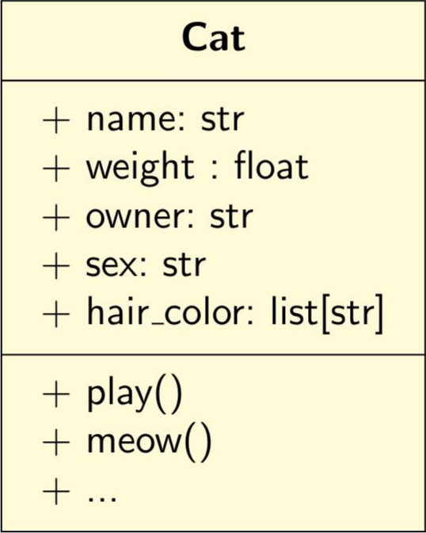
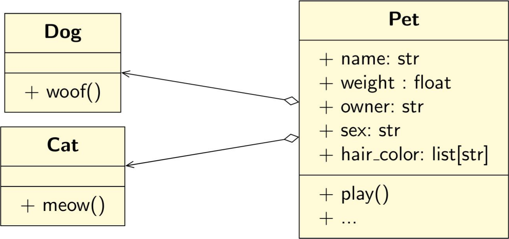
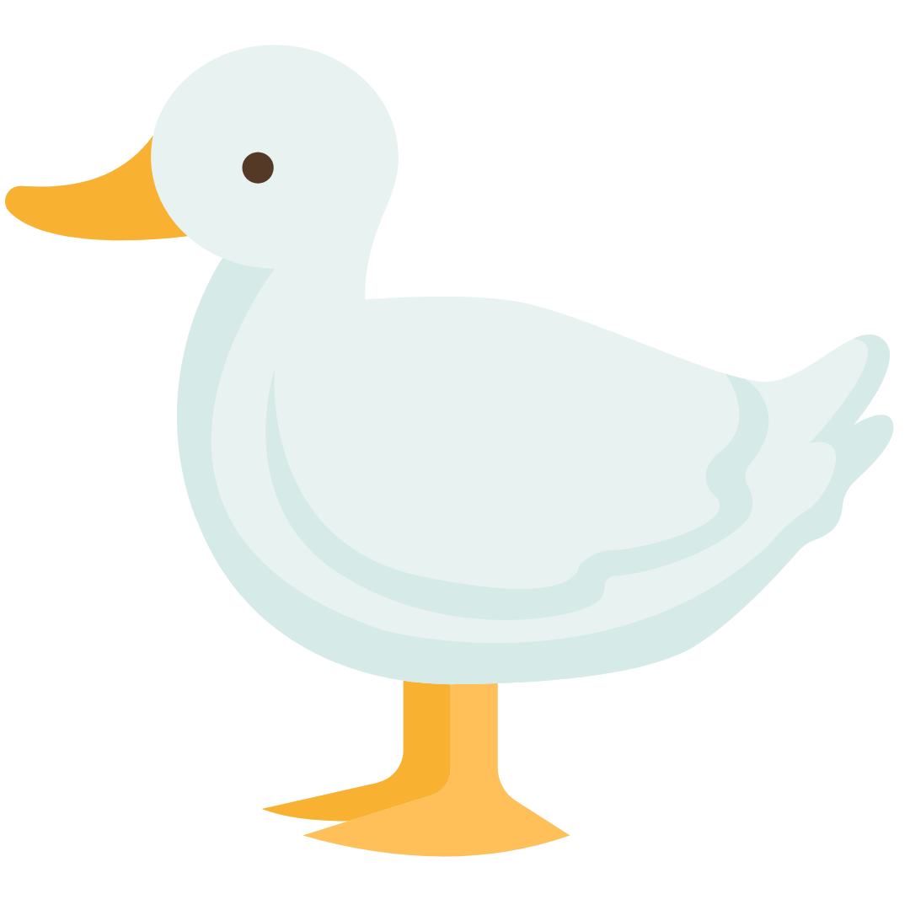

# Paradigmas de programación

* Los paradigmas de programación son diferentes estilos de construir programas.

* Al momento de diseñar un lenguaje de programación se incluyen en él
construcciones que faciliten un estilo u otro de programación.

* Luego, en base a esas construcciones los programas siguen uno u otro estilo
de programación.

# Paradigma Imperativo

* En el paradigma imperativo, los programas se construyen como una serie de
órdenes o instrucciones concretas.

* Como programadores, en un estilo imperativo lo que hacemos es pensar paso a
paso que es lo que queremos que nuestro programa haga.

* Algunos lenguajes imperativos son: **FORTRAN**, **C** o **C++**.

# Paradigma Orientado a Objetos

* La programación orientada a objetos es una evolución del paradigma imperativo.

* En este paradigma, los programadores pensamos los programas como una serie de
objetos que interactúan unos con otros.

* La mayoría de los lenguajes de programación orientados a objetos soportan
este estilo mediante el concepto de \textit{clases}, pero hay otras maneras.

* Algunos lenguajes orientados a objetos son: **Java**, **C #** o **JavaScript**.

# ... y Python?

. . .

Puede ser imperativo...

```python
!include code/unidad0/imperativo.py
```

# ... y Python?

. . .

Puede ser orientado a objetos...

```python
!include code/unidad0/oo.py
```

# Multiparadigma

* Python es **multiparadigma**, combina propiedades de distintos lenguajes de
programación.

* Lo podemos usar con distintos estilos y usar distintos estilos según sea lo
mas apropiado para cada problema.

* Incluso podemos mezclar estilos dentro del mismo programa, pero debemos
intentar siempre que el resultado sea un programa claro, limpio y legible.
Ante la duda, mejor agregar comentarios al código.

* Sobre todo, Python es un lenguaje orientado a objetos. En Python todo es un
objeto, en un sentido preciso que veremos mas adelante.

# Programacion Orientada a Objetos

* La idea de un objeto es representar una entidad de la vida real.

* Los objetos son una *abstracción* del objeto real y modelan la parte de su
comportamiento que nos interesa para nuestro programa.

* Un objeto tiene tres características fundamentales, **identidad**, **estado**
y **comportamiento**.

# Programacion Orientada a Objetos

::::: {.columns align=center}
::: {.column}
Este es Melón, el gato de mi amiga Sofi! Es un gato de pelo naranja y blanco,
pesa 6kg. Melón come, maúlla, ronronea y juega.
:::
::: {.column}
 {width=35%}
:::
:::::

# Programacion Orientada a Objetos

::::: {.columns align=center}
::: {.column}
* **Identidad**: Melón.
* **Estado**: Pelo de colores naranja y blanco, pesa 6kg. Su dueña es Sofi. Macho.
* **Comportamiento**: Comer, maullar, ronronear, jugar, etc.
:::
::: {.column}
 {width=35%}
:::
:::::

# Programacion Orientada a Objetos

::::: {.columns align=center}
::: {.column}
Esta es Amelia, la gata de mi amiga Pauli. Es una gata de pelo colores negro,
marrón y blanco, pesa 4kg. Amelia come, maúlla, ronronea y juega.
:::
::: {.column}
 {width=35%}
:::
:::::

# Programacion Orientada a Objetos

::::: {.columns align=center}
::: {.column}
* **Identidad**: Amelia.
* **Estado**: Pelo de colores negro, marrón y blanco, pesa 4kg. Su dueña es Pauli. Gata hembra.
* **Comportamiento**: Comer, maullar, ronronear, jugar, etc.
:::
::: {.column}
 {width=35%}
:::
:::::

# Programacion Orientada a Objetos

::::: {.columns align=center}
::: {.column}
Este es Bobo, el gato de mi amiga Mela. Es un gato de pelo color gris. Pesa
5kg. Bobo come, maúlla, ronronea y juega.
:::
::: {.column}
 {width=35%}
:::
:::::

# Programacion Orientada a Objetos

::::: {.columns align=center}
::: {.column}
* **Identidad**: Bobo.
* **Estado**: Pelo de color gris, pesa 4kg. Su dueña es Mela. Macho.
* **Comportamiento**: Comer, maullar, ronronear, jugar, etc.
:::
::: {.column}
 {width=35%}
:::
:::::

# ¿Que tienen en comun?

::::: {.columns align=center}
::: {.column}
 {width=30%}
:::
::: {.column}
 {width=30%}
:::
::: {.column}
 {width=30%}
:::
:::::

# Clases como tipos de ~~gatos~~ datos

* La forma más sencilla de pensar en las clases es pensarlas como un nuevo tipo
de datos.

* Lo principal que agrupa a Melón, Bobo y Amelia es que son justamente gatos.

* Representaremos en nuestros programas a Melón, Bobo y Amelia como objetos
pertenecientes a la **clase** Gato.

* Los tipos de datos nativos de Python (*int*, *float*, *bool*), de hecho,
están implementados como clases.

# Clases

* Una clase es una plantilla para la creación de objetos nuevos.

* A las distintas características que tendrá el objeto (peso, colores de pelo,
dueñx, etc.) las llamamos **atributos**.

* A los distintos comportamientos asociados al objeto (comer, maullar,
ronronear, etc.) los llamamos **métodos**.

* La clase es un nivel más de abstracción en nuestros programas.

# Diagrama de clase

 {width=35%}

# ... en Python

```python
!include code/unidad0/Cat.py
```

#

¿Que imprime lo siguiente?

```python
!include code/unidad0/instances.py

!include code/unidad0/prints.py
```

# Composicion

Como una clase define un nuevo tipo de datos, nada impide usar este nuevo tipo
de datos como tipo de uno de los atributos de otra clase.

# Herencia

* La herencia de clases es un concepto fundamental de la POO.

* Nos permite reutilizar muchísimo código.

* Nos permite extender casos que ya contemplábamos a nuevos casos sin perder
generalidad.

* Cuando hay objetos de distintos tipos, pero que guardan una estrecha
relación entre sí, podemos implementar los comportamientos comunes en una misma
clase, y luego *especializar* la clase.

# Programacion Orientada a Objetos

::::: {.columns align=center}
::: {.column}
Este es León, el perro de mi hermana Romi. Es un perro de pelo marrón, pesa
6kg. León come, ladra y juega.
:::
::: {.column}
 {width=35%}
:::
:::::

# Programacion Orientada a Objetos

::::: {.columns align=center}
::: {.column}
* **Identidad**: León.
* **Estado**: Pelo de colore marrón, pesa 6kg. Su dueña es Romi. Macho.
* **Comportamiento**: Comer, ladrar, jugar, etc.
:::
::: {.column}
 {width=35%}
:::
:::::

# Diagrama de clase

 {width=70%}

 #

 ```python
 !include code/unidad0/Pet.py
 ```

 #

 ```python
 !include code/unidad0/herencia.py

 !include code/unidad0/prints2.py
 ```

 #

 ```python
 !include code/unidad0/Dog.py

 !include code/unidad0/prints2.py
 ```

 # Duck Typing

::::: {.columns align=center}
::: {.column}
* Python tiene tipado dinámico, entonces, ¿cómo decide de qué tipo es cada objeto?
* "*Si camina como un pato y grazna como un pato, entonces debe ser un pato*".
* Duck-typing o tipado pato.
:::
::: {.column}
 {width=35%}
:::
:::::

# Preguntas

-----------------------------
 ¿PREGUNTAS?
-----------------------------

# Referencias

* Apunte de Cátedra. Elaborados por el staff docente. Será subido al campus
virtual de la materia.

* A. Downey et al, 2002. How to Think Like a Computer Scientist. Learning with
Python. Capitulos 12 a 16.
