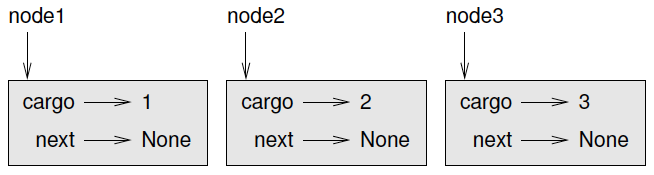
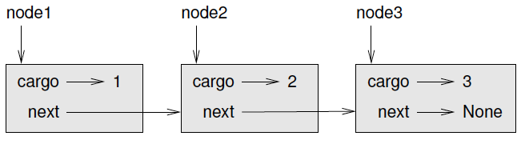
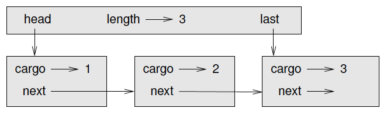

# Introducción a Tipos Abstractos de Datos

Un **tipo abstracto de datos** o **TAD** es:

* una **colección de datos**

* acompañada de un **conjunto de operaciones para manipularlos** de forma tal
que queden ocultas la representación interna del nuevo tipo y la implementación
de las operaciones, para todas las unidades de programa que lo utilice.

# Introducción a Tipos Abstractos de Datos

¿Por qué son **útiles los tipos abstractos de datos**?

* Simplifica el desarrollo de algoritmos utilizando las operaciones del tipo
abstracto de dato, sin importar cómo las mismas son implementadas.

* Dado que una operación puede ser implementada de diferentes formas en un TAD,
resulta útil escribir algoritmos que puedan ser usados con cualquiera de sus
posibles implementaciones.

* Algunos TADs utilizados con frecuencia, son implementados en librerías
estándares de manera que puedan ser utilizados por cualquier programador.

* Las operaciones de los TADs proveen un especie de lenguaje de alto nivel para
discutir y especificar otros algoritmos.

# Tipos Abstractos de Datos - Clientes y Proveedores}

Uno de los objetivos fundamentales de un TAD es separar los intereses del
**proveedor**, quien escribe el código que implementa el TAD, y del **cliente**,
quien usa el TAD.

El **proveedor** sólo tiene que preocuparse de si la implementación es correcta,
en de acuerdo con la especificación del TAD, y no con la forma en que se utilizará.

Por el contrario, el **cliente** asume que la implementación del TAD es correcta
y no se preocupa por los detalles. Cuando se utiliza uno de los tipos integrados
de Python, podemos pensar exclusivamente como clientes.

# TAD - Pila (Stack)}

Un TAD define las operaciones que pueden ser realizadas sobre el tipo de datos
que se está definiendo, lo cual llamamos **interfaz**.

La **interfaz de una pila** consiste en las siguientes operaciones:

* `__init__`: inicializa una pila vacía.

* `push`: agrega un nuevo elemento a la pila.

* `pop` elimina y devuelve un elemento de la pila. El elemento devuelto es
siempre el último agregado.

* `isEmpty`: chequea si la pila está vacía o no.

La **pilas** también se llaman estructuras **LIFO** (del inglés Last In First
Out), debido a que el último elemento en entrar será el primero en salir.

# Implementando Pilas con Listas en `Python`

Las operaciones de **lista** que proporciona `Python` son similares a las
operaciones que definen a una **pila** La interfaz no es exactamente la misma
pero podemos escribir código para traducir del TAD **pila** a las operaciones
integradas (built-in) de **listas** en `Python`.

Este código se denomina implementación del TAD **pila**. En general, una
implementación es un conjunto de métodos que satisfacen los requisitos
sintácticos y semánticos de una interfaz.

# Implementando Pilas con Listas en `Python`

Aquí hay una implementación del TAD **pila (Stack)** que usa una **lista** de
`Python`:

```python
!include code/unidad1/Pila.py
```

# TADs - Colas (Queues)

Presentamos ahora dos TADs:

* la **Cola** (queue) y
* la **Cola de Prioridad** (priority queue).

En la vida real, una cola es una fila de clientes que esperan algún tipo de
servicio. En la mayoría de los casos, el primer cliente en la fila es el próximo
cliente en ser atendido, aunque hay excepciones.

La regla que determina quién va a continuación se denomina **política de colas**.
La política de colas más simple se llama **FIFO** (del inglés "First In, First
Out").

La política más general de colas es la cola prioritaria, en la que a cada
cliente se le asigna una prioridad y el cliente con la prioridad más alta va
primero, independientemente del orden de llegada.

# TADs - Colas (Queues)

El TAD **Cola** y el TAD **Cola de Prioridad** **tienen el mismo conjunto de
operaciones**.

La **diferencia está en la semántica de las operaciones**: una cola usa la
política FIFO; y una cola de prioridad (como sugiere el nombre) utiliza la
política de cola de prioridad.

# El TAD Cola

El TAD Cola se define mediante las siguientes operaciones:

* `__init__`: inicializa una nueva cola vacía.

* `insert`: agrega un nuevo elemento a la cola.

* `remove`: eliminar y devolver un elemento de la cola. El artículo que se
devuelve es el primero que se agregó.

* `isEmpty`: Comprueba si la cola está vacía.

Antes de pasar a implementar las colas, introduciremos una nueva clase que nos
va a ser de mucha utilidad, la clase `Nodo (Node)`.

# Clase Nodo (Node)

Como es habitual al escribir una nueva clase, comenzaremos con los métodos
`__init__` y `__str__` para que podamos probar el mecanismo básico de crear y
mostrar el nuevo tipo:

```python
!include code/unidad1/Node.py
```

Como de costumbre, los parámetros para el método de inicialización son
opcionales. Por defecto, tanto la carga como el enlace al siguiente nodo se
setean a `None`.

# Uso de Node

Para probar la implementación hasta ahora, podemos crear un Nodo e imprimirlo:

```
>>> node = Node("test")
>>> print(node)
test
```

# Uso de Node

Para hacerlo interesante, podemos crear una lista con más de un nodo:

```
!include code/unidad1/nodes.py
```

{width=60%}

# Uso de Node

Para enlazar los nodos, tenemos que hacer que el primer nodo apunte al segundo
y el segundo nodo, al tercero.

```python
!include code/unidad1/list.py
```

{width=60%}

# Uso de Node


```python
!include code/unidad1/printList.py
```

Para invocar a esta función, pasamos la referencia al primer nodo:

```
>>> printList(node1)
1 2 3
```

# TAD Cola - Implementación como Cola Enlazada

La primera implementación del TAD **Cola** que veremos se llama **Cola Enlazada**
porque está formado por objetos **Nodos Enlazados**, que acabamos de introducir.

Una cola enlazada es:

* la cola vacía, representada por ningún nodo (`None`), o
* un nodo que contiene un objeto de carga y una referencia a un enlace de la cola.

#

```python
!include code/unidad1/Cola.py
```

# Perfomance

**¿Cuánto tiempo lleva ejecutar un método y cómo funciona? ¿Cambia el tiempo de
ejecución a medida que aumenta el número de elementos de la colección?**

Primero miremos `remove`. Esta operación se ejecuta en un **tiempo constante**.

La "performance" del `insert` es muy diferente. Dado que el tiempo de ejecución
resulta una función lineal de la longitud de la cola, este método se dice que se
ejecuta en un **tiempo lineal**.

# TAD Cola - Impementación como Cola Enlazada Mejorada

{width=60%}

# TAD Cola - Impementación como Cola Enlazada Mejorada

```python
!include code/unidad1/Cola2.py
```

# TAD `Cola de Prioridad`

El TAD `Cola de Prioridad` (`Priority Queue`) tiene la misma interfaz que el
TAD **Cola** (`Queue`), pero diferente semántica. De nuevo, la interfaz es:

* `__init__`: inicializa una nueva cola vacía.

* `insert`: agrega un nuevo elemento a la cola.

* `remove`: eliminar y devolver un elemento de la cola. El artículo que se
devuelve es el que tiene mayor prioridad.

* `isEmpty`: Comprueba si la cola está vacía.

# TAD `Cola de Prioridad`

Veamos una implementación de `Priority Queue` que tiene como atributo una lista
de `Python` que contiene los elementos en la cola.

```python
!include code/unidad1/PriorityQueue.py
```

Observemos el método `remove`.

# TAD `Cola de Prioridad`

Vamos a probar la implementación:

```python
>>> q = PriorityQueue()
>>> q.insert(11)
>>> q.insert(12)
>>> q.insert(14)
>>> q.insert(13)
>>> while not q.isEmpty(): print(q.remove())
14
13
12
11
```

# TAD `Cola de Prioridad`

Si la cola contiene otro tipo de objeto que no sea un número o un string, se
debe proveer los métodos mágicos necesarios para implementar la comparación.

+----------+----------+
| Operador | Método   |
+:========:+==========+
|   `==`   | `__eq__` |
+----------+----------+
|   `!=`   | `__ne__` |
+----------+----------+
|   `< `   | `__lt__` |
+----------+----------+
|   `<=`   | `__le__` |
+----------+----------+
|   `> `   | `__gt__` |
+----------+----------+
|   `>=`   | `__ge__` |
+----------+----------+

Cada uno de estos métodos debe tomar, además del `self` otro valor del mismo
tipo y devolver un valor booleano. Otra alternativa es devolver el valor
`NotImplemented` si queremos marcar explícitamente que la comparación no esta
definida y utilizarla es un error.

# Preguntas

-----------------------------
 ¿PREGUNTAS?
-----------------------------

# Referencias

* Apunte de Cátedra. Elaborados por el staff docente. Será subido al campus
virtual de la materia.

* A. Downey et al, 2002. How to Think Like a Computer Scientist. Learning with
Python. Capitulos 12 a 16.
