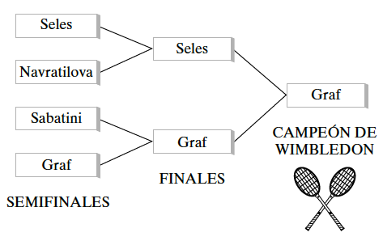
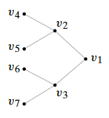
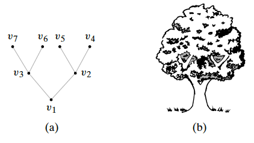
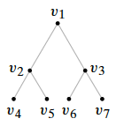
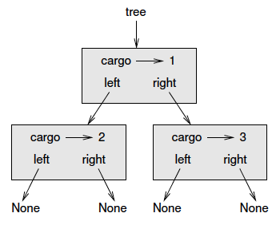
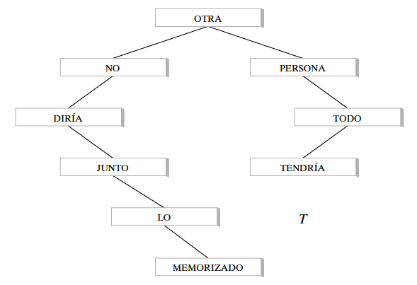
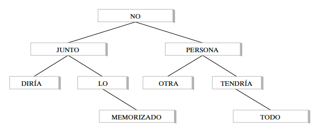

# Arbol (Tree)

Introduciremos en esta presentación la terminología asociada a **árboles**.

La figura de la izquierda muestra los resultados de las semifinales y finales
de la competencia de tenis clásico en Wimbledon.

A la derecha se representa el torneo como un árbol.

::::: {.columns align=center}
::: {.column}
 {width=80%}
:::
::: {.column}
 {width=50%}
:::
:::::

# Arbol (Tree)

{width=80%}

# Arbol (Tree)

La definición formal es la siguiente:

Un **árbol** $T$ (libre) es una gráfica simple que satisface lo siguiente: si
$v$ y $w$ son vértices en $T$, existe una trayectoria simple única desde $v$ a
$w$.

Un **árbol con raíz** es un árbol en el que un vértice específico se designa
como raíz.

# Arbol (Tree)

Al contrario de los árboles naturales, cuyas raíces se localizan abajo, en
teoría de grafos los árboles con raíces suelen dibujarse con la raíz hacia arriba.

{width=30%}

# Arbol (Tree)

Como la trayectoria simple de la raíz a cualquier vértice dado es única, cada vértice está en un nivel determinado de manera única.

{width=20%}

El **nivel** de la raíz es el nivel $0$. Se dice que los vértices abajo de la
raíz están en el nivel $1$, y así sucesivamente. Entonces el nivel de un vértice
$v$ es la longitud de la trayectoria simple de la raíz a $v$. La **altura** de
un árbol con raíz es el número máximo de nivel que ocurre.

Los vértices $v_1$, $v_2$, $v_3$, $v_4$, $v_5$, $v_6$, $v_7$ en el árbol están
(respectivamente) en los niveles $0$, $1$, $1$, $2$, $2$, $2$, $2$. La altura
del árbol es $2$.

# Arbol (Tree)

Sea $T$ un **árbol con raíz** $v_0$. Suponga que $x$, $y$ y $z$ son vértices en
$T$ y que $(v_0, v_1, \cdots , v_n)$ es una trayectoria simple en $T$. Entonces:

* $v_{n-1}$ es el **padre** de $v_n$.

* $v_0, \cdots , v_{n-1}$ son **ancestros** de $v_n$.

* $v_n$ es un **hijo** de $v_{n-1}$.

* Si $x$ es un ancestro de $y$, $y$ es un **descendiente** de $x$.

* Si $x$ e $y$ son hijos de $z$, $x$ e $y$ son **hermanos**.

* Si $x$ no tiene hijos, $x$ es un **vértice terminal (o una hoja)**.

* Si $x$ no es un vértice terminal, $x$ es un **vértice interno (o una rama)**.

* El **subárbol** de $T$ con raíz en $x$ es el grafo con el conjunto de vértices
V y el conjunto de aristas $E$, donde $V$ es $x$ junto con los descendientes de
$x$; y $E = \{e | e$ es una arista en una trayectoria simple de $x$ a algún
vértice en $V\}$.

# Árbol Binario (Binary Tree)}

Un **árbol binario** es un árbol con raíz en el que cada vértice tiene ningún
hijo, un hijo o dos hijos. Si el vértice tiene un hijo se designa como un hijo
izquierdo o como un hijo derecho (pero no ambos). Si un vértice tiene dos hijos,
un hijo se designa como hijo izquierdo y el otro como hijo derecho.

Un **árbol binario completo** es un árbol binario en el que cada vértice tiene
dos o cero hijos.

# Implementación de árboles binarios

Al igual que las colas, podemos representar los árboles compuestos por nodos.
Un tipo común de árbol que ya presentamos es un árbol binario, en el que cada
nodo contiene una referencia como máximo a otros dos nodos. Estas referencias se
denominan subárboles izquierdo y derecho. Los nodos de los árboles contienen
datos.

{width=45%}

# Implementación de árboles binarios

Los árboles son estructuras de datos recursivas porque se definen recursivamente.

Un **árbol binario** es:

* el **árbol vacío**, representado por `None`, o
* un **nodo** que contiene una referencia de objeto **y dos referencias a
árboles binarios**.

Una implementación en `Python` de Árbol Binario (BinaryTree) se ve así:

```python
!include code/unidad1/BinaryTree.py
```

#

Una forma de construir un árbol es de abajo hacia arriba. Asigne los nodos
secundarios primero. Luego cree el nodo padre y vincúlelo a los hijos:

```python
!include code/unidad1/construccion.py
```
Podemos escribir este código de manera más concisa anidando invocaciones de
constructores:

```python
!include code/unidad1/concisa.py
```

{width=34%}

# Árboles Binarios de Búsqueda

Un **árbol binario de búsqueda** (o en inglés Binary Search Tree) es un árbol
binario $T$ en el que se asocian datos a los vértices. Los datos están
arreglados de manera que, para cada vértice $v$ en $T$, cada dato en el subárbol
de la izquierda de $v$ es menor que el dato en $v$, y cada dato en el subárbol
de la derecha de $v$ es mayor que el dato en $v$.

::::: {.columns align=center}
::: {.column}
 {width=100%}
:::
::: {.column}
 {width=100%}
:::
:::::

--------------------------------------------------------
 OTRA PERSONA NO DIRÍA TODO JUNTO LO TENDRÍA MEMORIZADO
--------------------------------------------------------

# Ingresar un Nuevo Dato en un Árbol Binario de Búsqueda

La siguiente implementación en `Python` permite ingresar un nuevo dato
`new_data` en un árbol binario de búsqueda `BST_tree`:

```python
!include code/unidad1/insert.py
```

# Construcción de un Árbol Binario de Búsqueda

Podemos crear un árbol binario de búsqueda a partir de datos en una lista
`data_list`, usando la siguiente implementación en `Python`:

```python
!include code/unidad1/fromList.py
```

# Búsqueda de Dato en un Árbol Binario de Búsqueda

Los árboles binarios de búsqueda son útiles para localizar datos. Esto es, a
partir de un dato $D$, es fácil determinar si $D$ está presente en un árbol
binario de búsqueda y dónde se localiza. Veamos la siguiente implementación en
`Python`:

```python
!include code/unidad1/search.py
```

# Recorridos de árboles

El **recorrido de árboles** se refiere al proceso de visitar los nodos de un
árbol de una manera sistemática, exactamente una vez. Tales recorridos están
clasificados por el orden en el cual son visitados los nodos.

Describiremos algoritmos para un árbol binario, pero también pueden ser
generalizados a otros árboles.

PreOrden (PreOrder)
  ~ Para recorrer un árbol binario no vacíao en *preorden*, hay que realizar
  las siguientes operaciones recursivamente en cada nodo, comenzando con el
  nodo de raíz:

+ Visite la raíz
+ Recorra en PreOrden el sub-árbol izquierdo
+ Recorra en PreOrden el sub-árbol derecho

# Recorridos de árboles

El **recorrido de árboles** se refiere al proceso de visitar los nodos de un
árbol de una manera sistemática, exactamente una vez. Tales recorridos están
clasificados por el orden en el cual son visitados los nodos.

Describiremos algoritmos para un árbol binario, pero también pueden ser
generalizados a otros árboles.

InOrden (InOrder)
  ~ Para recorrer un árbol binario no vacíao en *inorden*, hay que realizar
  las siguientes operaciones recursivamente en cada nodo, comenzando con el
  nodo de raíz:

+ Recorra en InOrden el sub-árbol izquierdo
+ Visite la raíz
+ Recorra en InOrden el sub-árbol derecho

# Recorridos de árboles

El **recorrido de árboles** se refiere al proceso de visitar los nodos de un
árbol de una manera sistemática, exactamente una vez. Tales recorridos están
clasificados por el orden en el cual son visitados los nodos.

Describiremos algoritmos para un árbol binario, pero también pueden ser
generalizados a otros árboles.

PostOrden (PostOrder)
  ~ Para recorrer un árbol binario no vacíao en *postorden*, hay que realizar
  las siguientes operaciones recursivamente en cada nodo, comenzando con el
  nodo de raíz:

+ Recorra en PostOrden el sub-árbol izquierdo
+ Recorra en PostOrden el sub-árbol derecho
+ Visite la raíz

# Recorridos de árboles

El **recorrido de árboles** se refiere al proceso de visitar los nodos de un
árbol de una manera sistemática, exactamente una vez. Tales recorridos están
clasificados por el orden en el cual son visitados los nodos.

En general, la diferencia entre *PreOrden*, *InOrden* y *PostOrden* es cuándo
se recorre la raíz. En los tres, se recorre primero el sub-árbol izquierdo y
luego el derecho.

#

Imprimimos los nodos usando las siguientes implementaciones en `Python`:

```python
!include code/unidad1/recorridos.py
```

# Preguntas

----------------------------
 ¿PREGUNTAS?
-----------------------------

# Referencias

* Apunte de Cátedra. Elaborados por el staff docente. Será subido al campus
virtual de la materia.

* A. Downey et al, 2002. How to Think Like a Computer Scientist. Learning with
Python. Capitulos 12 a 16.

* R. Johnsonbaugh, 2005. Matemáticas Discretas, 6ta Edición, Pearson Educación,
México. Capítulo 9.
